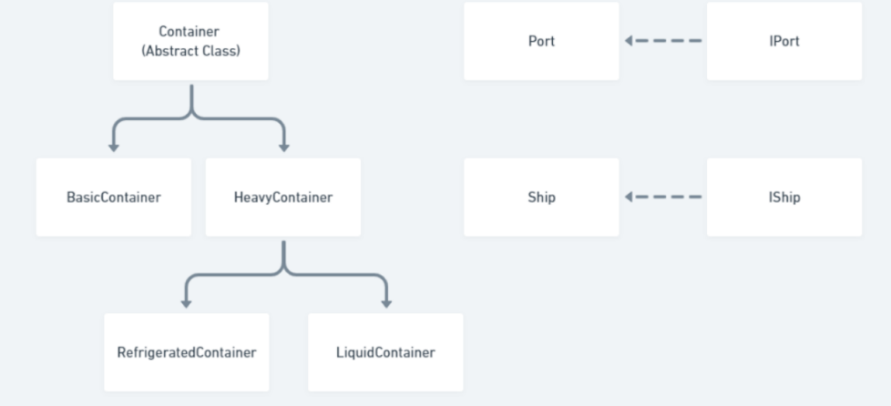

# Case study: Port Management System

There are ports, and ships are sailing between them. Ships are carrying the following types of containers: basic,
heavy, refrigerated, liquid, and each of them should be handled differently. Containers in a port can be loaded to
ships, and, conversely, they can be unloaded from a ship to port. Ships need a certain amount of fuel to sail from
one port to another.

You are expected to implement these classes (which will be explained in detail in the rest of this document):

1. Main.java
2. Port.java
3. Ship.java
4. Container.java
5. BasicContainer.java
6. HeavyContainer.java
7. RefrigeratedContainer.java
8. LiquidContainer.java

> You are expected to use the following interfaces:
1. IShip.java
2. IPort.java

> NB: The class hierarchy that you must consider during the implementation is illustrated in the class diagram below:

   

## Main.java

### The main class should bee a menu driven class with the following options
* Create a container
* Create a ship
* Create a port
* Load a container to a ship
* Unload a container from a ship
* Sail ship to another port
* Refuel Ship

### Creating a container
A container will have an ID/Serial # which is unique to every container. It will also have weight, for which if the
weight is lessthan 5000kg then it will be considered a basic container, otherwise it is a heavy container. The special
type of heavy container is given as “R” or “L”, which stand for Refrigerated and Liquid, respectively. There may or
may not be an “R” or “L” after weight. It is important to note that Refrigerated and Liquid Containers are special
types of heavy container, meaning that input lines that contain “R” or “L” should always create the respective type
of container regardless of the weight.

### Creating a port
When creating a port, two double inputs are given, which are the x and y coordinates of the port. The IDs of the
ports are also determined by the simulation.
Creating a ship

When creating a ship, you should consider having the following fields:
* The ID of the port where the ship initially is
* Maximum weight of all containers in that ship (nonzero)
* Maximum number of all containers in that ship (counting all types of containers) (maybe zero)
* Maximum number of heavy containers in that ship (counting refrigerated and liquid containers) (maybe zero)
* Maximum number of refrigerated containers in that ship (maybe zero)
* Maximum number of liquid containers in that ship (maybe zero)
* Fuel tank capacity (nonzero)
* Current fuel level (maybe zero)
* A nonzero input denoting the fuel consumption per km of that ship.

### Loading a container
When loading a container into a ship, you supply IDs of ship and container. A container with that ID may or may
not exist and may or may not be in the port where the ship currently is so appropriate response/feedback must
be given. Ship with the given ID may or may not exist as well and appropriate feedback must be given. If the
container is currently in the port, it may or may not be loaded into the ship depending on the restrictions of that
ship. For example, let us consider a ship with a maximum weight of 50 000kg which can carry 10 containers, at
most 5 heavy containers, maximum of 3 refrigerated containers and 4 liquid containers. If the ship currently has 3
BasicContainers, 3 HeavyContainers, 2 RefrigeratedContainers, 0 LiquidContainers. The sum of all containers above
is 46000kg.

* It is a HeavyContainer: Loading is not possible, as there are already 5 heavy containers (3 + 2 + 0).
* It is a RefrigeratedContainer: Loading is not possible, as there are already 5 heavy containers (3 + 2 + 0).
* It is a LiquidContainer: Loading is not possible, as there are already 5 heavy containers (3 + 2 + 0).
* It is a BasicContainer: Loading possible if weight is less than or equal to 4000kg (500000 - 46000 = 4000)

### Unloading a container
When unloading a container from a ship, IDs of ship and container may or may not exist and appropriate feedback
must be given. A container with that ID may or may not be on the ship. If a container with the given ID exists in a
ship, it will be placed into the storage of the port where the ship currently is.
Sailing of ships

When ships travel from one port to another, IDs of the ship and destination port are given. Fuel consumption of
the ship consists of the value that was given in the creation stage and consumption of containers. In short, if a ship
has enough fuel it will sail to the destination port.

### Fueling ship
When fuel is added to a ship, the ID of the ship and amount of fuel is given.

`Port.java`
Port class should have the following variables, exactly named as below:
* int ID
* double latitude
* double longitude
* `ArrayList<Container> containers`
* `ArrayList<Ship> history` : keeps track of every ship that has visited
* `ArrayList<Ship> current` : keeps track of the ships currently here

Port must implement the IPort interface and the methods it requires. The class should have the following methods,
exactly as named below:
* A constructor with three parameters, ID, latitude, and longitude.
* A method that calculates the distance between the object itself and another Port, double getDistance(Port
other)
> Additionally, the choice of defining the variables as private, protected, or public may require additional getter and
  setter methods. This applies to all other classes as well, unless specified otherwise.

`Ship.java`
Ship class should have the following variables, exactly named as below:
* int ID
* double fuel
* Port currentPort

Ship must implement the IShip interface and the methods it requires. The class should have the following methods,
exactly as named below:
* public Ship(int ID, Port p, int totalWeightCapacity,
* int maxNumberOfAllContainers,
* int maxNumberOfHeavyContainers,
* int maxNumberOfRefrigeratedContainers,
* int maxNumberOfLiquidContainers,
* double fuelConsumptionPerKM)
* `ArrayList<Container> getCurrentContainers()` : should return the list of all containers currently in the ship sorted by ID.

`Container.java`
Container is an abstract class and should have the following fields:
* int ID
* int weight

It should have the following methods:
* A constructor with parameters ID, weight
* double consumption() : should return fuel consumption required by the container
* boolean equals(Container other) : check type, ID and weight of a container. If they are the same, return
true, otherwise return false.

`BasicContainer.java` and `HeavyContainer.java`
They should extend the Container class. They should have a constructor with two inputs like a Container.
* Weight of a BasicContainer <= 5000
* Weight of a HeavyContainer : otherwise

Fuel consumption is as follows:
* BasicContainer : 2.50 per unit of weight
* HeavyContainer : 3.00 per unit of weight

`RefrigeratedContainer.java` and `LiquidContainer.java`
They are special types of HeavyContainer and should extend the HeavyContainer class. They should have a
constructor with two inputs like a HeavyContainer.

Fuel consumption is as follows:
* RefrigeratedContainer : 5.00 per unit of weight
* LiquidContainer : 4.00 per unit of weight

Interface Details

`IPort.java`
You are already provided with this interface. Do not modify the code in this file! It contains the following method:
* void incomingShip(Ship s) : should add this ship to current ArrayList.
* void outgoingShip(Ship s) : should add this ship to history ArrayList.
  > Note that there should not be any duplicates in the current and history ArrayLists (i.e. do not add the same ship to history if it has already visited that port before)

`IShip.java`
You are already provided with this interface. Do not modify the code in this file! It contains the following method:
* boolean sailTo(Port p) : returns true if a ship successfully sailed to the destination port
* void reFuel(double newFuel) : adds fuel to a ship
* boolean load(Container cont) : returns true if a container was successfully loaded to a ship
* boolean unLoad(Container cont) : returns true if a container was successfully unloaded from a ship